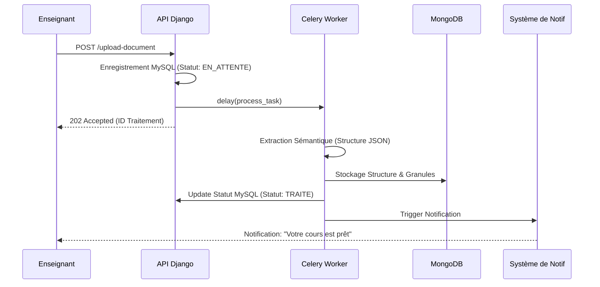

# XCSM Backend - Documentation des Cas d'Utilisation

Ce document détaille les scénarios d'utilisation de la plateforme XCSM, organisés par acteurs et flux de travail.

## Acteurs du Système

### Acteurs Principaux

- **Enseignant** : Expert métier qui fournit le contenu pédagogique brut (PDF/DOCX).
- **Étudiant** : Apprenant qui consulte les granules pédagogiques structurés.
- **Administrateur** : Gestionnaire système chargé de la maintenance et de la surveillance.

### Acteurs Secondaires

- **Système (Worker Celery)** : Entité automatisée traitant les documents et les notifications.
- **Provider Email/Push** : Services externes (SMTP Firebase) pour la livraison des messages.

---

## 1. Gestion du Contenu Pédagogique (Enseignant)

### CU-1.1 : Upload et Structuration Automatique

- **Description** : L'enseignant soumet un document pour transformation.
- **Flux Principal** :
    1. L'enseignant sélectionne un fichier (PDF ou DOCX) et lui donne un titre.
    2. Le backend enregistre le fichier brut et crée une entrée "En attente".
    3. Une tâche asynchrone (Celery) démarre l'extraction.
    4. Le système identifie les titres (H1, H2) et découpe le texte en granules.
    5. La structure complète est stockée dans MongoDB.
    6. L'enseignant reçoit une notification (Email/App) une fois le traitement terminé.
- **Cas d'Erreur** : Si le fichier est corrompu, le statut passe à "ERREUR" et l'enseignant est notifié avec le motif.

### CU-1.2 : Consultation de la Hiérarchie

- **Description** : Visualiser comment le document a été interprété.
- **Détails** : L'enseignant accède à une vue arborescente montrant les Parties, Chapitres et Sections générés dynamiquement à partir du JSON structuré.

---

## 2. Expérience de l'Apprenant (Étudiant)

### CU-2.1 : Recherche Granulaire (Recherche Globale)

- **Description** : Trouver un concept spécifique à travers tous les cours.
- **Détails** : L'étudiant saisit un mot-clé. Le système interroge MongoDB pour trouver les granules les plus pertinents et affiche le contexte (dans quel cours et quel chapitre se trouve le résultat).

### CU-2.2 : Consultation d'un Granule

- **Description** : Lecture d'une unité atomique de connaissance.
- **Détails** : L'étudiant clique sur une section. Le système récupère le contenu HTML sémantique stocké dans MongoDB pour un affichage propre et léger.

---

## 3. Administration et Maintenance (Admin)

### CU-3.1 : Surveillance de la Production

- **Description** : Vérifier la santé du système.
- **Détails** : L'administrateur consulte les statistiques de stockage MongoDB et les journaux de tâches Celery pour s'assurer qu'aucun document n'est bloqué.

### CU-3.2 : Communication de Maintenance

- **Description** : Informer tous les utilisateurs d'un arrêt planifié.
- **Détails** : L'admin envoie une notification "Masse" qui génère des milliers d'envois asynchrones (Email + Push) sans ralentir l'API.

---

## 4. Automatisation Système (Système)

### CU-4.1 : Génération de Synthèse (Digest)

- **Description** : Regrouper les notifications pour éviter le spam.
- **Flux** :
    1. Chaque période (ex: 24h), le système identifie les notifications non lues.
    2. Il génère un email récapitulatif unique pour l'utilisateur.
    3. Les notifications individuelles sont marquées comme "traitées dans la synthèse".

### CU-4.2 : Anonymisation lors de la Suppression

- **Description** : Respect du RGPD.
- **Détails** : Lorsqu'un compte est supprimé, le système archive les stats, mais remplace l'email et le nom par des valeurs anonymes dans tous les journaux d'audit.

---

## Diagramme de Flux : Traitement de Document

